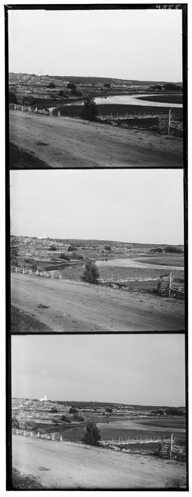

# Image Alignment and Enhancement

This project processes grayscale images by splitting them into color channels, aligning the channels, and enhancing the final image. The results are saved in the `results` directory.

## Features
- Splits grayscale images into Blue, Green, and Red channels.
- Aligns the Green and Red channels to the Blue channel using the Sum of Squared Differences (SSD) metric.
- Enhances the aligned image for better visual quality.
- Saves the unaligned, aligned, and enhanced images for comparison.

## Prerequisites
- Python 3.x
- OpenCV
- NumPy

## Setup
1. Clone the repository or download the project files.
2. Install the required dependencies:
   ```bash
   pip install opencv-python-headless numpy
   ```
3. Ensure the following directory structure:
   ```
   project/
   ├── code/
   │   ├── main.py
   │   ├── alignment.py
   │   ├── enhancement.py
   │   ├── utils.py
   │   └── ...
   ├── data/
   │   └── images/  # Place your input images here
   └── results/     # Output images will be saved here
   ```

## Code Overview
### `main.py`
The entry point of the project. It:
- Reads grayscale images from the `data/images` directory.
- Splits the image into Blue, Green, and Red channels.
- Aligns the Green and Red channels to the Blue channel.
- Enhances the aligned image.
- Saves the unaligned, aligned, and enhanced images to the `results` directory.

**Example:**
```python
# filepath: ...\code\main.py
@measure_time
def process_image(path):
    img = cv2.imread(path, cv2.IMREAD_GRAYSCALE)
    B, G, R = split_image(img)

    shift_G = align_channels(B, G, 15, metric="ssd")
    shift_R = align_channels(B, R, 15, metric="ssd")

    G_aligned = np.roll(G, shift_G, axis=(0, 1))
    R_aligned = np.roll(R, shift_R, axis=(0, 1))

    unaligned = cv2.merge([B, G, R])
    aligned = cv2.merge([B, G_aligned, R_aligned])
    enhanced = enhance_image(aligned)

    save_results(RESULTS_DIR, os.path.splitext(os.path.basename(path))[0], unaligned, aligned, enhanced)
```

### `alignment.py`
Contains functions for:
- Splitting an image into its Blue, Green, and Red channels.
- Aligning channels using the Sum of Squared Differences (SSD) metric.

**Example:**
```python
# filepath: c:\Users\muham\Desktop\p1set\code\alignment.py
def align_channels(base_channel, target_channel, max_shift, metric="ssd"):
    # ...existing code...
    return best_shift
```

### `enhancement.py`
Contains functions for:
- Enhancing the aligned image to improve visual quality (e.g., contrast adjustment, sharpening).

**Example:**
```python
# filepath: c:\Users\muham\Desktop\p1set\code\enhancement.py
def enhance_image(image):
    # Apply histogram equalization or other enhancement techniques
    # ...existing code...
    return enhanced_image
```

### `utils.py`
Contains utility functions for:
- Saving the processed images to the `results` directory.
- Measuring the execution time of functions.

**Example:**
```python
# filepath: c:\Users\muham\Desktop\p1set\code\utils.py
def save_results(output_dir, base_name, unaligned, aligned, enhanced):
    cv2.imwrite(os.path.join(output_dir, f"{base_name}_unaligned.jpg"), unaligned)
    cv2.imwrite(os.path.join(output_dir, f"{base_name}_aligned.jpg"), aligned)
    cv2.imwrite(os.path.join(output_dir, f"{base_name}_enhanced.jpg"), enhanced)
```

## Metrics
Two similarity metrics are available for alignment:

- **SSD (Sum of Squared Differences)**: Minimizes squared intensity differences.
  - Optimize: lower is better
  - Pros: Fast, robust to moderate noise; good default
  - Cons: Sensitive to global brightness/contrast changes

- **NCC (Normalized Cross-Correlation)**: Maximizes normalized correlation between patches.
  - Optimize: higher is better
  - Pros: Invariant to linear brightness/contrast changes; better when exposure varies
  - Cons: Slightly slower than SSD

Implementation details:
- 10% borders are ignored during scoring to reduce edge artifacts.
- Search window is configurable via `search_range` in `align_channels`.
- For large images, `pyramid_align` uses coarse-to-fine search and accepts the same `metric`.

Choose the metric in code:

```python
# Standard alignment with SSD (default behavior in examples)
shift_G = align_channels(B, G, 15, metric="ssd")
shift_R = align_channels(B, R, 15, metric="ssd")

# Use NCC when exposure differs between channels
shift_G = align_channels(B, G, 15, metric="ncc")
shift_R = align_channels(B, R, 15, metric="ncc")

# Pyramid alignment also accepts the metric parameter
shift_G = pyramid_align(B, G, levels=3, metric="ncc")
shift_R = pyramid_align(B, R, levels=3, metric="ncc")
```

Guidance:
- Use SSD for speed and when lighting is consistent.
- Use NCC if channels differ in brightness/contrast or there is vignetting.
- Increase `search_range` on very misaligned inputs; enable `pyramid_align` for large images.

## Usage
1. Place your `.jpg` images in the `data/images` directory.
2. Run the `main.py` script:
   ```bash
   python main.py
   ```
3. The processed images will be saved in the `results` directory.

## Example Output
For each input image, the following outputs are generated:
- **Unaligned Image**: The original image with unaligned channels.
- **Aligned Image**: The image after channel alignment.
- **Enhanced Image**: The final enhanced image.

## Before vs After (Examples)
Below are quick visual examples comparing inputs and outputs.

### Single example (original vs enhanced)
| Original (before) | Enhanced (after) |
| --- | --- |
|  |  |

### Full pipeline example (unaligned → aligned → enhanced)
| Unaligned | Aligned | Enhanced |
| --- | --- | --- |
|  |  |  |

## Notes
- Ensure the `data/images` directory exists and contains valid `.jpg` images.
- The `results` directory will be created automatically if it does not exist.
